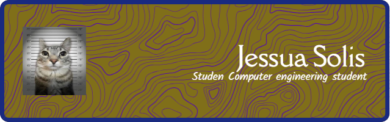
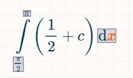
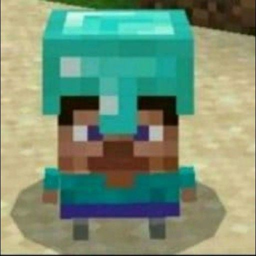

# Hi my name is Jessua 

<h2 Style = "color: #ffffbf" >I am a computer engineering student who loves:</h2>

    <ol> 
        <li style = "color: #572364">Numbers</li>
        <!------------------------>
        
        <!------------------------>
        <li style = "color: #53295e">Games</li>
        <!------------------------>
        
        <!------------------------>
        <li style = "color: #5c1b6c">Music</li>
        <!------------------------>
        
        <!------------------------>
        <li style = "color: #683475"><strong>Melon juice</strong></li>
        <!------------------------>
        
    </ol>

## Technologies that I use:

    
       

<h2 Style = "color: #ffffbf"> I am a CS50x.ni staff </h2>
    

